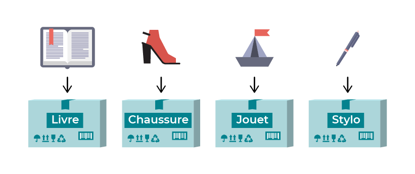

# Comment exécuter votre code ?

## Expérimentez avec la console

- Exécutez `python` ou `python3` dans le terminal pour lancer un interpréteur **Python**.
- La console est votre terrain de jeu, alors tester des choses, soyez créatif !

## Exécutez un fichier python

- Créez un fichier avec l'extension **.py**
- Editez le fichier avec **VS Code**
- Dans le terminal, exéutez-le avec `python nom_du_fichier.py`
- Utilisez `print()` pour afficher quelque chose dans le terminal

# Les Objects Intégrés (class)

```python
type("Hello World")             #=> str / String
type(12)                        #=> int / Integer
type(3.14)                      #=> Float
type(["Hello World", 12, 3.14]) #=> list (Tableau)
type(range(10))                 #=> range
type(True)                      #=> bool / Boolean
type(False)                     #=> bool / Boolean
```

## String

```python
'hello world!'.upper() #=> 'HELLO WORLD!'
'HELLO WORLD!'.lower() #=> 'hello world!'
```

```python
"Hello" == 'Hello' #=> True
```

**Concaténation**
```python
print('Hello' + ' ' + 'World!') #=> Hello World!
```

**f-string**
```python
print(f"two: {1 + 1}") #=> two: 2
```

**Convertion en integer**
```python
type('2024')       #=> <class 'str'> / String
int('2024')        #=> 2024
type(int('2024'))  #=> <class 'int'> / Integer
```

## Interger
```python
# Maths Basiques
1 + 2  #=> 3
3 * 5  #=> 15
# Modulo
10 % 3 #=> 1 # Le modulo est utilisé pour obtenir le reste de la division d'un entier par un autre
8 % 2  #=> 0 # Un entier est pair s'il est divisible par 2, c'est à dire que le reste de la division par 2 est 0
# Conversion en string
str(5) #=> '5'
```

## Float
```python
round(1.4142) #=> 1
round(1.4142, 2) #=> 1.41
```

## List
```python
list('Hello')                                    #=> ['H', 'e', 'l', 'l', 'o']
sorted([3, 5, 1])                                #=> [1, 3, 5]
sorted(['Louis', 'Daniel', 'Alfred'])            #=> ['Alfred', 'Daniel', 'Louis']
sorted(['Louis', 'Alfred', 'Zoe'], reverse=True) #=> ['Zoe', 'Louis', 'Alfred']
```

## Range
```python
list(range(10))       #=> [0, 1, 2, 3, 4, 5, 6, 7, 8, 9]
list(range(0, 11, 3)) #=> [0, 3, 6, 9]
```

## Valeurs Spéciales
```python
None
True
False
```

# Les Variables

Une **variable**, c’est comme un carton. C’est un moyen d’enregistrer vos données. En tant que développeur, il vous faudra enregistrer certaines informations et leur donner un nom afin de pouvoir les récupérer plus tard. Un nom d’utilisateur, des tickets d’avion encore disponibles, le jour de la semaine, un inventaire... Toutes ces données sont enregistrées dans les variables.



> Une variable dans Python est constituée de trois éléments :
>  - Son nom
>  - Son type
>  - Sa valeur

## Assignation et lecture
```python
age = 17
name = 'Paul'
print(f"{name} is {age} years old.")
#=> Paul is 17 year's old.
```

## Réassignation / Incrémentation
```python
population = 2000000
population = population + 30000
population += 30000
```

# Les Méthodes (fonctions)

## Qu'est-ce que c'est ?
> Une méthode en programmation est un bloc de code réutilisable qui effectue une tâche spécifique. 
> Elle peut prendre des entrées (appelées paramètres), effectue une série d'actions ou de calculs, 
> et peut renvoyer une valeur en résultat.
>
> Les méthodes permettent de structurer le code en le rendant plus organisé, évitant la répétition.
> Elles sont généralement associées à des objets (dans les langages orientés objet comme Python)
> ou simplement appelées fonctions (dans d'autres langages).

**Problème**
```python
print('Hello John')
print('Hello Paul')
print('Hello Ringo')
```

**Solution** : factoriser le code
```python
def say_hello(name):
  return f"Hello {name}"

print(say_hello('John'))  #=> 'Hello John'
print(say_hello('Ringo')) #=> 'Hello Ringo'
```

Règle en programmation :
**DON'T REPEAT YOURSELF** [DRY](https://en.wikipedia.org/wiki/Don%27t_repeat_yourself)

## Pourquoi les méthodes ?
- Factoriser votre code
- Une façon concise d'appeler du code Python
- Appliquer un code à des entrées dynamiques
- **WARNING!** Attention à l'indentation du code !

```python
def full_name(first_name, last_name):
  name = first_name.capitalize() + ' ' + last_name.capitalize()
  return name

my_first_name = 'samuel'
my_last_name = 'schwob'
my_full_name = full_name(my_first_name, my_last_name)
print(my_full_name) #=> Samuel Schwob
```

## Paramètres vs Arguments
```python
def new_population(population, births):
  return population + births

print(new_population(200000, 30))
```

- Ici, `population` et `births` sont des paramètres
- `200000` et `30` sont des arguments
- Les arguments sont des valeurs prises par les paramètres

## Conventions
- Noms des méthodes et des variables en **snake_case** :
> Les méthodes et les variables sont écrites en snake_case, ce qui signifie que toutes les lettres sont en minuscule 
> et les mots sont séparés par des underscores (_).
> Les méthodes retournant un booléen sont souvent nommées de manière à indiquer clairement leur but,
> comme `is_valid`, `has_items`, etc.
- Pas de mot-clé `return` obligatoire :
> les fonctions qui n'ont pas de `return` explicite retournent automatiquement `None`
> si elles atteignent la fin de leur bloc sans renvoyer une valeur.
